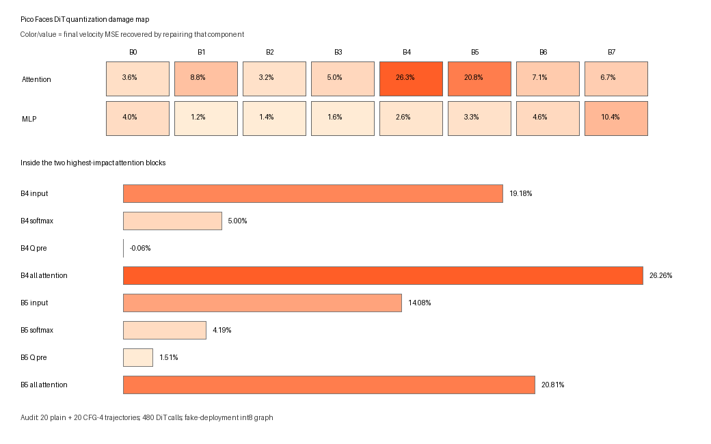
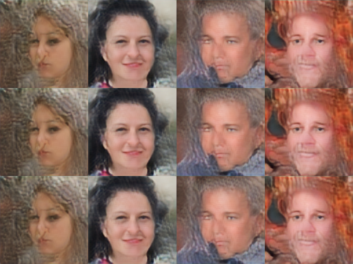
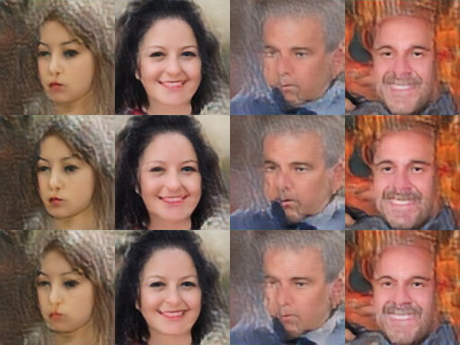

# Pico Faces: an RP2350 quantization extension

This repository is an experimental extension of Tim B.'s **Pico Faces**
project—not a separate implementation of the generator.

Start with Tim's original work:

- [AI Image Generation on an RP2350 Microcontroller — Tim's Blog](https://cpldcpu.github.io/2026/08/28/ai-image-generation-on-a-rp-pico-2-microcontroller/)
- [`cpldcpu/pico-faces` — original source and models](https://github.com/cpldcpu/pico-faces)

Tim built and trained the latent flow diffusion transformer, VAE decoder,
post-training quantization pipeline, C inference engine, and RP2350 firmware.
His system generates 128 x 128 faces entirely on a Pico 2-class
microcontroller and returns them over USB or displays them through optional
VGA hardware.

This extension investigates two of the opportunities Tim called out at the
end of his article:

1. whether AdaLN-single-style conditioning could reduce the conditioning
   tables; and
2. whether better activation scaling could reduce int8 quantization damage.

The first became a promising research experiment but was not deployed. The
second produced the custom, board-tested firmware released here.

## What this extension changed

The deployed change is deliberately small. It uses Tim's released
`m3_long_cfg` architecture, trained weights, VAE, sampler, classifier-free
guidance, C engine, and firmware. Before folding the model, it changes only
two scalar calibration entries:

| Quantized activation | Original scale | New scale | Multiplier |
| --- | ---: | ---: | ---: |
| DiT Block 4 attention input | 7.5036 | 13.5064 | 1.80x |
| DiT Block 5 attention input | 6.2364 | 8.7309 | 1.40x |

These scales set the real-value interval represented by one int8 step. The
original ranges were slightly too narrow for the noisiest early diffusion
steps, so some unusually large activation values were clipped. Enlarging the
ranges prevents that clipping. Enlarging them too far would make ordinary
values round more coarsely, so the multipliers were selected by a measured
sweep rather than simply maximizing the range.

No model retraining, model architecture, inference code, or sampling schedule
was changed for the released firmware.

## How the problem was located

We compared Tim's floating-point checkpoint with a fake-deployment int8 graph
over 20 plain and 20 CFG-4 trajectories: 480 DiT calls in total. An “oracle
repair” temporarily restored one quantized component to floating point and
measured how much final velocity error disappeared.



Block 4 attention accounted for 26.26% of recoverable final velocity MSE and
Block 5 attention for 20.81%. The largest causal sources inside those blocks
were the AdaLN-normalized attention-input grids. Their clipping was
concentrated at the first two, noisiest timesteps; it was nearly absent from
`t=0.625` onward.

With the selected scales:

| Teacher-state metric | Original int8 scales | New scales | Effect |
| --- | ---: | ---: | ---: |
| Velocity MSE | 0.005049 | 0.003718 | 26.4% lower |
| Relative RMSE | 8.65% | 7.43% | 14.1% lower |
| Block 4 input clipping | 0.284% | 0.000% | eliminated in the audit |
| Block 5 input clipping | 0.275% | 0.0016% | nearly eliminated |

## Impact on generated images

The purpose of the change is not to make the model generate different people
or stronger classes. It makes the integer model follow Tim's original
floating-point generator more closely. The seed, class, pose, and overall
composition remain stable; the accumulated quantization deviations become
smaller.

The comparison grids below use the same seeds and display three rows in this
order: **floating-point reference, original int8 fold, rescaled int8 fold**.

### Plain sampling



### CFG 4 sampling



On four fixed seeds/classes at four Euler steps, the byte-exact integer
simulator measured:

| Mode | Metric versus float | Original fold | Rescaled fold | Change |
| --- | --- | ---: | ---: | ---: |
| Plain | Mean pixel error | 3.0804 | **2.3269** | 24.5% lower |
| Plain | PSNR | 35.73 dB | **37.95 dB** | +2.22 dB |
| CFG 4 | Mean pixel error | 6.7495 | **5.9700** | 11.5% lower |
| CFG 4 | PSNR | 28.89 dB | **29.65 dB** | +0.76 dB |

Lower mean pixel error and higher PSNR both mean that the deployed integer
output is closer to the float reference. The improvement is visually subtle,
as it should be: the baseline already generates coherent faces. It is best
understood as reduced quantization distortion rather than a new aesthetic or
a general proof of better-looking images.

The broader 32-trajectory fake-quant test showed the same direction: plain
pixel error fell from 5.78 to 3.89 and CFG-4 error from 9.39 to 7.32.

## From experiment to a physical Pico 2

The rescaled calibration was folded into a separate 2,567,828-byte model blob.
The existing portable C engine matched the Python exact-integer simulator
byte-for-byte for four additional cases spanning plain and CFG 4/6/8 paths.
The blob was then embedded into RP2350 ARM-S firmware and flashed to a
Raspberry Pi Pico 2.

| Physical-board test | Time | CRC32 | Simulator comparison |
| --- | ---: | --- | --- |
| Plain, seed 42, class 1, 4 steps | 3,401 ms | `b693c574` | all 49,152 bytes match |
| CFG 4, seed 42, class 1, 4 steps | 5,344 ms | `94ee4f2c` | all 49,152 bytes match |

That confirms the changed calibration—not a desktop-only approximation—was
running on the RP2350.

## AdaLN-single experiment

The other extension explored replacing block-specific AdaLN conditioning with
a shared time-and-class function plus block offsets. Directly sharing the
tables damaged predictions substantially. A conditioning-only student trained
against the original model recovered 82.8% of that gap, making the approach
promising, but expanded training exposed a tradeoff between late-step velocity
loss and complete-image agreement. It was therefore **not** included in the
firmware release. See [the full experimental record](CAPSTONE.md) for the
numbers and next-step options.

## Download and use

- [GitHub release v1.0.0](https://github.com/mattackerman1/pico-faces-lab/releases/tag/v1.0.0)
- [Firmware package and flashing instructions](releases/pico-faces-attn45-v1/README.md)
- [Custom UF2](releases/pico-faces-attn45-v1/pico_faces_m3_long_cfg_attn45.uf2)
- [Full capstone record](CAPSTONE.md)

To use the host-side USB GUI:

```powershell
git clone --recurse-submodules https://github.com/mattackerman1/pico-faces-lab.git
cd pico-faces-lab
python -m venv .venv
.\.venv\Scripts\Activate.ps1
python -m pip install -r requirements-gui.txt
.\launch_gui.ps1
```

No VGA hardware is required.

## Scope and limitations

- The exact-integer image comparison contains four fixed seeds/classes; it is
  a regression-quality experiment, not a large perceptual study.
- Pixel error and PSNR measure fidelity to the float model. They do not, by
  themselves, prove that viewers will prefer every tuned image.
- The current-environment baseline and tuned blobs were folded together so the
  scale change is isolated. The original release blob could not be reproduced
  byte-for-byte because its exact PyTorch/export environment was not pinned.
- This is an independent experimental extension and is not an official
  `cpldcpu/pico-faces` release.

## Attribution and license

Pico Faces, its models, training and quantization code, inference engine, and
firmware are by Tim B. (`cpldcpu`) and distributed under the upstream MIT
license. The upstream repository is pinned here as a Git submodule. The
release package includes Tim's license and an untouched upstream UF2 for
rollback.

The step-by-step lessons, analysis tools, reports, GUI, and calibration
experiment in this repository document our extension of that work.
